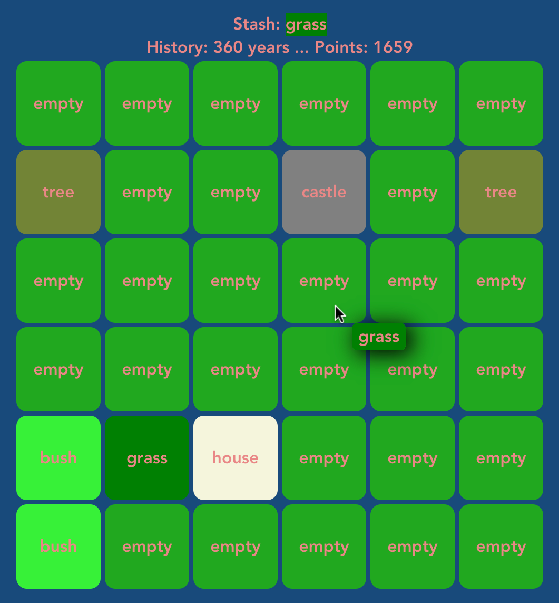

# triple-town-clone

A clone of the [Triple Town mobile game](https://apps.apple.com/us/app/triple-town-fun-addictive-puzzle-matching-game/id490532168).

[The rules](https://support.spryfox.com/hc/en-us/articles/219104828-How-to-play-Triple-Town).

#### Original features implemented

- Each new game is random.
- Merge 3+ adjacent things to create next thing e.g. bushes become tree.
- Store something for later in your stash.
- Track town age and game points.

#### Original features missing

- Bears, graves, churches
- Diamonds
- Rocks, mountains
- Chests

#### Extra features

- Sky castles are not enough. They can merge to become a space station! 🛰️
- Done away with pesky bloated graphics in favour of efficient text-based visualisation!
